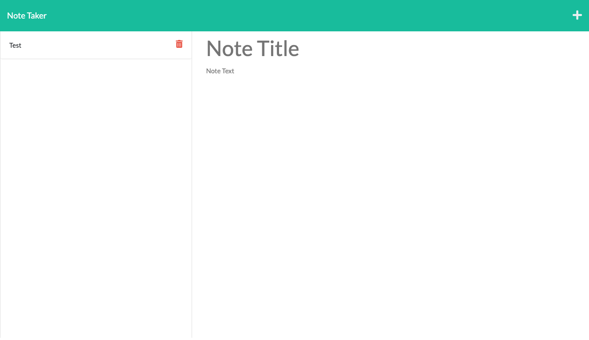

# Note Taker

## Table of Contents
* [Description](#description)
* [Installation instructions](#installation-instructions)
* [Usage Information](#usage-information)
* [License](#license)
* [Contribution Guidelines](#contribution-guidelines)
* [Test Instructions](#test-instructions)
* [Questions](#questions)

## Description
I created a note taker application based off of existing front end code. This application allows users to write and save notes. Express.JS was used to build the back end.

## Installation Instructions
N/A

## Usage Information
Visit the deployed site, write some notes, then click the save icon!

Deployed Link:[https://fierce-gorge-36704.herokuapp.com/]

## License
[MIT](https://opensource.org/licenses/MIT)

## Contribution Guidelines
N/A

## Test Instructions
N/A

## Questions
Have any addition questions? Contact me!
&nbsp;  
GitHub: [sprantis](https://github.com/sprantis)
&nbsp;
Email: sprantis@gmail.com